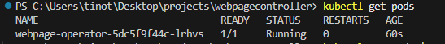

<!-- REFERENCE: https://medium.com/@muradu.iurie.1986/controller-runtime-write-your-own-kubernetes-operators-from-scratch-bcd9c7fb81fa -->

# Controller-Runtime: Writing your own K8s Operator and Deploy it to a kinD Cluster

## Pre-requisites
- [Go1.24](https://go.dev/doc/install) (that's what I used, feel free to try other versions)
- [Docker Desktop](https://docs.docker.com/desktop/setup/install/windows-install/)
- [kubectl](https://kubernetes.io/docs/tasks/tools/install-kubectl-windows/)
- [kinD](https://kind.sigs.k8s.io/docs/user/quick-start/) (I recommend the `go install`, pretty easy)

## Docs to go through before starting (gives you an idea of what's happening)
- [Kubernetes](https://kubernetes.io/docs/home/)
- [Operator Pattern](https://kubernetes.io/docs/concepts/extend-kubernetes/operator/)
- [Controller-Runtime](https://pkg.go.dev/sigs.k8s.io/controller-runtime)

## Follow the steps below (don't follow blindly though)

1. Write the Kubernetes Operator following [this](https://medium.com/@muradu.iurie.1986/controller-runtime-write-your-own-kubernetes-operators-from-scratch-bcd9c7fb81fa) and use [this](https://kind.sigs.k8s.io/docs/user/quick-start/#creating-a-cluster) to create a kinD cluster.
2. Define your CR and CRD YAML file (we are hardcoding, there are examples in this repo) 
3. Create the CRD in the cluster (this is the command `kubectl apply -f <path-to-your-crd-file>.yaml`)
4. Test your Kubernetes Operator before deploying (`go run .` in the root of the project). Below is an example of what you should see.
 
 5. Test if the reconciling is working as expected (Open another terminal and run `kubectl apply -f <path-to-your-example-cr-file>.yaml`). If all is fine you should see:
 
 6. Pause, reflect on what you have done so far. Then move on to deployment steps
 7. Write the Dockerfile to be used for building a DOcker image for the Kubernetes (there is an example in this repo.)
 8. Run the command to build the docker image (`docker build -t webpage-operator:latest .` in the root of the project). If everything goes well your output should look close to the image below:
 
 9. Load the Docker image into the local Kubernetes cluster created with `kind` (run this command - `kind load docker-image webpage-operator:latest --name <your-cluster-name>`)
 10. Write your YAML file for the Kubernetes deployment configuration (there is an example in the repo - `manager.yaml`.)
 11. Write a `kustomization.yaml` file used to manage the deployment of the resources (CR, CRD and the Deployment of `webpage-operator`) to the Kubernetes cluster, and to configure the application (a good example in the repo as well).
 12. Run the command to apply the Kubernetes configurations defined in the above steps. (`kubectl apply -k config`). Your terminal output should look like the one below, not exactly but close.

 13. And there you have it, you have done it. Pat yourself on the back.
 14. Confirm that you really deserved that pat. (run `kubectl get pods `). You should see something like this.
 
 15. Perform the ultimate test, check the logs of your Kubernetes Operator. (run ` kubectl logs deploy/webpage-operator`). Compare your logs with mine and decide if you got it.
 
 16. For the fun of it, see the power of Kubernetes by deleting the operator, after a few seconds you will see it back up again (run `kubectl delete pod -l app=webpage-operator`)

 _THE END, Happy Coding!_
